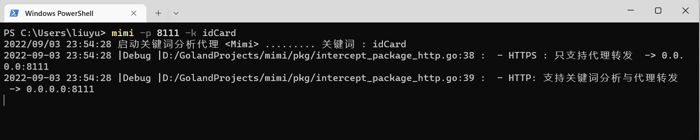

# Mimi

Mimi是一款通过代理手段扫描页面或者请求中是否包含可疑字段的应用,可以用于以下场景
1. 接口返回值是否包含隐私字段
2. 接口是否返回了一些违反规定的数据

# 快速使用
在命令行中运行代理服务
``` shell
mimi -p 8111 -k idCard
```


| 参数  | 解释    |
|-----|-------|
| p   | 指定端口  |
| k   | 指定关键词 |
| log | 日志级别  |

# 贡献

代码：可以帮助完成mimi项目一些任务、编写新的feature或者是修复一些bug；

测试：可以来参与测试代码的编写，包括了单元测试、集成测试、e2e测试；

文档：可以编写或完善文档，来帮助用户更好地了解和使用；

博客：可以撰写 mimi 的相关文章，来帮助更好地推广；

讨论：可以参与 mimi 新的feature的讨论

建议：也可以对项目提出一些建议，促进项目的良性发展；
